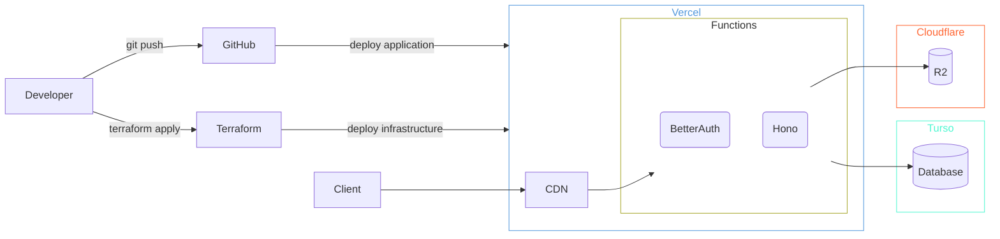

# Architecture

```mermaid
flowchart LR

D[Developer]
G[GitHub]
TF[Terraform]
C[Client]

subgraph V[Vercel]
    CDN
    subgraph F[Functions]
        subgraph N[Next.js]
            B(BetterAuth)
            H(Hono)
        end
    end
end

subgraph T[Turso]
    DB[(Database)]
end

subgraph CF[Cloudflare]
    R[(R2)]
end

D -- git push --> G
D -- terraform apply --> TF
G -- deploy application ----> V
TF -- deploy infrastructure ----> V

C --> CDN
CDN --> N
N --> DB
N --> R

classDef SV fill:none,color:#59d,stroke:#59d
class V SV

classDef SF fill:none
class F SF

classDef SN fill:none,color:#fff,stroke:#fff
class N SN

classDef ST fill:none,color:#4ff7d1,stroke:#4ff7d1
class T ST

classDef SCF fill:none,color:#f63,stroke:#f63
class CF SCF


```