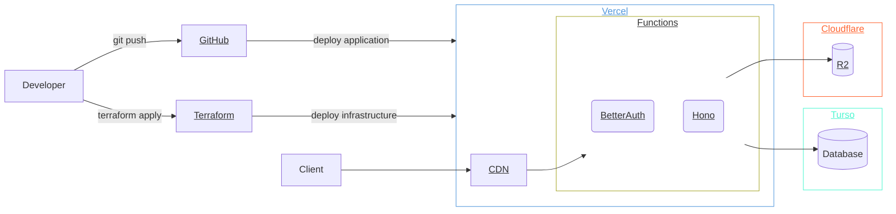

# Architecture

```mermaid
flowchart LR

D[Developer]
G[<a href='https://github.com' style='color:inherit'>GitHub</a>]
TF[<a href='https://www.terraform.io/' style='color:inherit'>Terraform</a>]
C[Client]

subgraph V[<a href='https://vercel.com' style='color:inherit'>Vercel</a>]
    CDN[<a href='https://vercel.com/docs/edge-network/overview' style='color:inherit'>CDN</a>]
    subgraph F[<a href='https://vercel.com/docs/functions' style='color:inherit'>Functions</a>]
        subgraph N[<a href='https://nextjs.org/' style='color:inherit'>Next.js</a>]
            B(<a href='https://www.better-auth.com/' style='color:inherit'>BetterAuth</a>)
            H(<a href='https://hono.dev/' style='color:inherit'>Hono</a>)
        end
    end
end

subgraph T[<a href='https://turso.tech/' style='color:inherit'>Turso</a>]
    DB[(Database)]
end

subgraph CF[<a href='https://www.cloudflare.com/' style='color:inherit'>Cloudflare</a>]
    R[(<a href='https://developers.cloudflare.com/r2/' style='color:inherit'>R2</a>)]
end

D -- git push --> G
D -- terraform apply --> TF
G -- deploy application ----> V
TF -- deploy infrastructure ----> V

C --> CDN
CDN --> N
N --> DB
N --> R

classDef SV fill:none,color:#59d,stroke:#59d
class V SV

classDef SF fill:none
class F SF

classDef SN fill:none,color:#fff,stroke:#fff
class N SN

classDef ST fill:none,color:#4ff7d1,stroke:#4ff7d1
class T ST

classDef SCF fill:none,color:#f63,stroke:#f63
class CF SCF


```