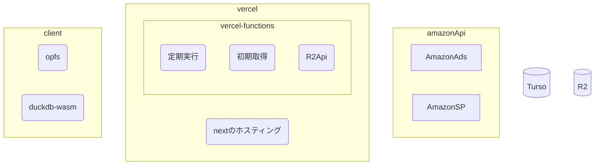

```mermaid
flowchart
subgraph amazonApi
api1[AmazonAds]
api2[AmazonSP]
end
db[(Turso)]
st[(R2)]
subgraph vercel
v3(nextのホスティング)
subgraph vercel-functions
    v1(定期実行)
    v2(初期取得)
    v4(R2Api)
end
end
subgraph client
cl1(opfs)
cl2(duckdb-wasm)
end
```